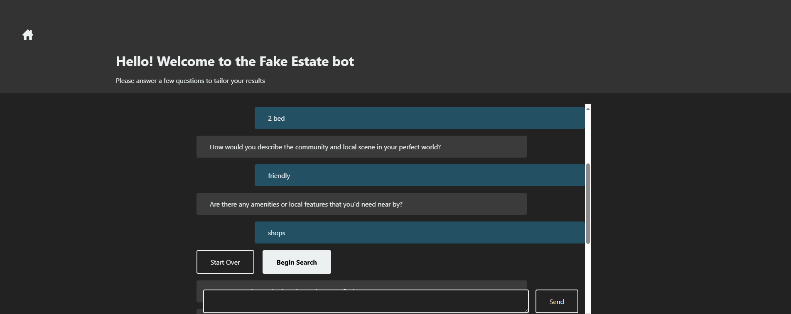

# Udemy AI Nano Degree - Project 4

## Real Estate Assistant

This application creates and hosts a vector database (ChromaDB) in which it stores fake property listings generaed by an LLM.

It will ask you some pre-set questions about your property preferences, and use these to retrieve a relevant listing. This listing will be used by an LLM to write a ful description, highlighting the features most applicable to you.



## Submission

Main submission is *__`home_match.py`__*.

### Generated Listings

Listings created by the LLM are filed in `.txt` files under `generated-listings/`.

A few prompts were used with somewhat constrained results each time, I have combined these into the actual listings file listings.txt

## Installing and running

The application is a Fast API based server which renders a front end locally.

*A note about python versions: ChromaDB requires sqlite>=3.35.0 to run meaning that some versions of python will not work.*

One one machine running python 3.9.2 I was unable to start the server, upgrading to 3.12.4 fixed it. Another of my devices has 3.11.2 and also works fine.

### Install python environment

It is recommended to create a virtual environment for this application. First, run the `venv` command to create the virtual environment.

#### Bash

```bash
python -m venv venv
source venv/Scripts/activate
```

#### Windows CMD

```bash
python -m venv venv
./venv/Scripts/activate.bat
```

```bash
pip install --upgrade pip
pip install -r requirements.txt
```

### Setup envfile.ini

You'll next need to create an `envfile.ini` to hold your openai API key, and optionally specific the port to run on locally. An example envfile is provided for quick start.

```bash
cp envfile.example.ini envfile.ini
```

In your envfile place your openai API key.

```ini
[DEFAULT]
OPENAI_API_KEY=<your key here>
PORT=8001
```

## Running the FastAPI server

The entry file is `home_match.py`, to run the server use the following.

```bash
python home_match.py
```

Navigate to [http://localhost:8001/](http://localhost:8001/) by default.

## Using the application

The application will prompt you with questions, answer each of these to create a specification. The system will then ask if you're happy with your choices or if you would like to start again to resubmit them.

Hit "Begin Search" to send the request to the LLM interface and receive a generated response.

## Credits

Thank you to the authors of these resources for their help at various stages

- [Getting Started with Chroma DB: A Beginner’s Tutorial by Random-log-int](https://medium.com/@pierrelouislet/getting-started-with-chroma-db-a-beginners-tutorial-6efa32300902)

- [Embed vector database into your web app using LanceDB by Tevin Wang](https://medium.com/etoai/improving-llm-based-web-applications-with-easy-to-use-and-free-serverless-vector-database-lancedb-254e1442a9b0)

- [Creating text dataset for LLM training using Lance - Lancedb Docs](https://lancedb.github.io/lance/examples/llm_dataset_creation.html)
